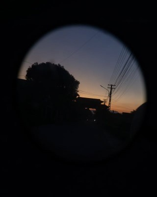

+++
title = "2024."
date = "2024-12-31T22:56:44+07:00"

#
# description is optional
#
description = "looking back ig"

tags = ["english","self",]
+++

# this year was (kinda) ass ngl
*looking back at 2024*

## haven't written anything in a while lol
for some reason whenever I get an idea I just write the first paragraph then sleep on it lol, writer's block I guess 😞. I swear there's some good shi coming when I have the time and motivation to finish them lmao, gotta trust the process. Manga/anime reviews, reviews in general, shit going on in my life, music, etc.

oh and if you have a stroke while reading this, sorry lol i wrote all this in like 30 minutes by basically pouring whatever words came out first. 

## a
I wasn't even sure what I was expecting for this year lol. Looking back, not that much has changed ig, but at least for the first time I can look back at a year and actually face whatever the heck has been happening:

### some goods
- national english third prize (holy fucking shit how did I even get this lol)
- new friends, reconnected with old ones, I love yall :3
- got way better at photography (was pretty proud of some of the stuff I took)
- learned to not live in a dumpster 
- spent *way* too much money on keyboards
- built an actual desk setup 🔥

### the ugly
- the academic comeback did NOT happen
- national english comp, 2nd time
- idk mental illnesses or sum (not really)

## details
### the national english comp, 1st time
Honestly this was the first time I was somewhat proud of myself lmao. The fact that I can be in the same team as a bunch of very talented, devoted and ambitious people is honestly fucking incredible. This was probably the best time of my high school life, everything from everyday on the NEC classroom to the Hanoi trip, every minute of that shit was bliss (okay these happened in 2023 but still). While the final results of the whole team wasn't totally satisfactory, I truly loved every minute of the whole learning process.

oh and I made bank from the prize money lmao, the sole reason how I can afford literally anything rn.

### the national english comp, 2nd time
Worst time of my life, full stop. The fact that I was already stranded for university entrance options should have been the blinding red flag that I should go all out and reject the homeroom teach, but my dumbass didn't. I thought I could get by with the second time, but everything somehow just got *worse and worse and worse and worse*. Physically drained, mentally exhausted, you can name them all. The teach, while caring, just didn't approach the whole thing the right way (in fairness to her *some* mfs had literal pre-schooler levels of mental development, which for an 11th grader is fucking crazy like??????). Eventually I did learn to just not care about none of the bullshit going on anymore, as after all the prize is basically academically worthless to me. But having the pressure of literally everyone on my head was kinda too much, and I did went a few sleepless nights because of everything going on.

Disconnecting with most of your friends wasn't as easy as I thought. No more basketball sessions, no more extra classes, etc. To be fair, I shouldn't have just rotted my free time away at dorm at those times, but I digress.

Of course, there's still some good, I still hold dear the times I spent with the people I fw in the team, they probably saved everything from getting way worse in this stupid time. Thanks to all the teachers as well!

It's all over now, I don't even gaf about the results anymore, and hope I (and my back) can recover from this.

### hobbies
#### photography
Photography has been one of my saving graces this year, keeping me active and always looking for good stuff to snap. Most of my pictures this year have been landscape, but I also got the courage to take pictures of other people as well, and the experience I got from those graduation shoots was the damn best. 

There's something soothing to me about trying to convey a story, or just emotions from mere pictures. 
#### the clickity clackity keebs
Oh all of this was lowkey stupid lmao, but still very fun and rewarding. Currently on my 5th keyboard rn, which is also the most expensive one. Some may call it dumb, a waste of time and money, yada yada, but I think that if you use and interact with something everyday, you should probably make that a worthwhile experience. Also, the idea of novelty is just pure joy, imagine making something that sits on your desk that you can tell yourself or others that "yeah i built that, and it's exactly how I like it."

overall one of the best part of my life recently. 
#### weeb shit
Read a lot of mangas, watched a lot of animes, some were good, some were ehh. To be honest I don't talk about this type of stuff in public a lot because of the weeb status that gets associated with them lmao. 

Some really hit *hard* and *close* to home though, truly life-changing works of literature:
- [The Summer You Were There](https://anilist.co/manga/117620/Kimi-to-Tsuzuru-Utakata/)
- [Violet Evergarden](https://anilist.co/anime/21827/Violet-Evergarden/)
- [Summer Ghost](https://anilist.co/anime/130050/Summer-Ghost/)
- [I sold my life for ten thousand yen per year.](https://anilist.co/manga/97553/Jumyou-wo-Kaitotte-Moratta-Ichinen-ni-Tsuki-Ichimanen-de/)

yes I'm writing about all of them eventually
## conclusion
I honestly don't know how to feel about this year. There's the good, the bad and the ugly, but that's how it goes for everyone, right? What's important is I got more emotionally mature, I know how to take care of myself better, I know how to treat people better, or at least that's how I like to think of myself. After all:

> *"Every individual is only a version of you"*

Of course, thank you to everyone that's been here (and left) for making my soul and this world a better place.

I have a lot on my plate for 2025 lol, IELTS, SAT, university entrance exams, uni itself. I don't know if I can do all of them to the level that I want, but here's hoping.

Happy new year, hope yall had a great 2024 and will have an amazing 2025.

~~*or yk i can just finish my wow of not making it past 18*~~ jk