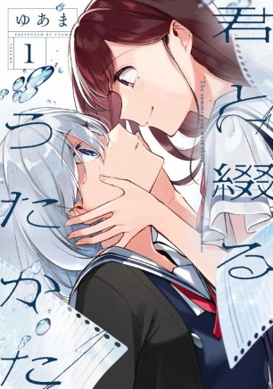
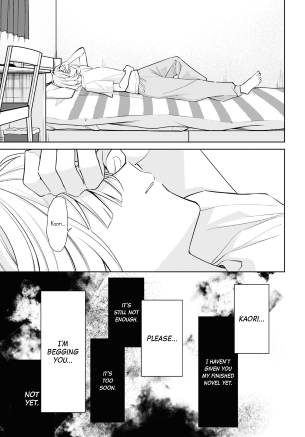
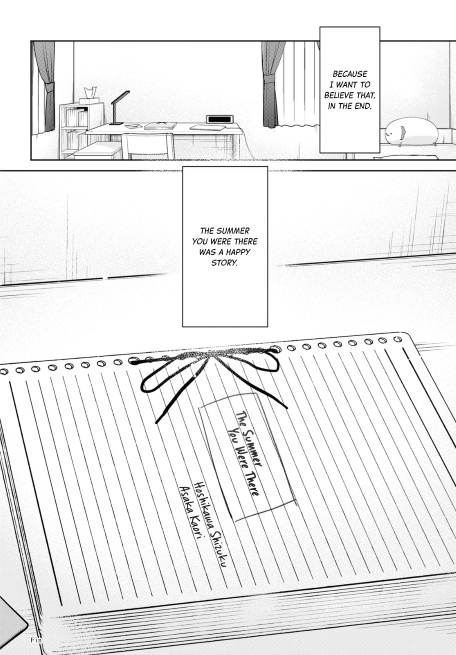

+++
title = "this manga broke me."
date = "2024-07-01T16:27:17+07:00"

#
# description is optional
#
# description = "hmuy's review of Kimi to Tsuzuru Utakata - The Summer You Were There"

tags = ["review","weebshit","english"]
+++

# Kimi to Tsuzuru Utakata - The Summer You Were There
*a review by hmuy.*

## introduction

As much of a disorganized mess as I am, I figured I'd try to write something while going through the oven that is SEA summer, and having read quite a few mangas over the past year or so, here we are. Do note though that these are gonna be less of reviews than me just putting my inhoherent ramblings and feelings about a story out there lol.

also "warning": idk wtf was going through my head but this whole thing sounds too fucking robotic and corny as fuck for some reason lmfao

ight, on to the manga. 
**WARNING: SPOILERS**

---

## the manga

*Warning:* This will bring you on a rollercoaster of emotions, and will certainly leave you feeling sad, devastated, and overwhelmed so **read at your own discretion**.

Kimi to Tsuzuru Utakata is a manga written and illustrated by Yuama and follows the story of Hoshikawa Shizuku - a desolate loner who would become the light of Asaka Kaori through a make-believe relationship. From its title:

> The Summer You **Were** There

and first chapters, it's clear that the story is *exactly* what it tells us to be, with a quickly ticking clock. Yet a new reader would know nearly nothing about our 2 MCs, forcing us to raise questions first for them to get answered along the way, allowing us to form a closer relationship with the story, the characters, and their emotions. Given the time limitations, the primary events repeatedly unfold, each of them serves as a reminder of the inevitable, giving Shizuku and Kaori every chance to understand each other with no distractions from day-to-day events. 

While [Bocchi The Rock](https://anilist.co/anime/130003/Bocchi-the-Rock/) does an extremely good job of potraying crippling social anxiety and insecurity, it more so represents how it *feels* to be a social outcast, whereas Shizuku's emotions are potrayed to be how it actually is to be one, combined with extreme self-loathing and regret of her past actions, whilst . In my opinion, Yuama succeded in the character-building of Shizuku, letting her turn from a closed up, self-hating loner to one who can eventually forgive herself and fall in love with Kaori, whilst not dismissing or downplaying her awful past and the trauma that she caused on Ruri. Every interaction in the story, but primarily between Shizuku and Kaori serves as a step towards Shizuku's self-redemption and self-reconciliation, as she learns to accept her (wrongful) past, present, pain and regrets, mainly for the sake of Kaori, but eventually for herself as well, unknowningly at first.

Turning to Kaori - Shizuku's "make - believe" girlfriend, though the whole plotline of "girl saves MC then dies by the end" is getting kinda old for me, mainly because it's practically a cliche at this point, while also painting the picture of the savior as being selfish, manupilative and insensitive, all for their own benefits, Asaka Kaori is written to have an absolutely kind and pure heart, fully committing to Shizuku's development without any ill-intent. That is not to say she doesn't have her own woes as well. Apart from the obvious, she does have a problem of coming clean and being honest herself, as one would expect when she wants Shizuku to be honest to herself, especially in the beginnings of their relationships - hiding behind a mask of a cheerful, energetic character while her own soul slowly dies inside. That being said, it's good that the author is at least giving more depth to Kaori than just the character that dies after "fixing" the MC. She has her own life, with her own friendship circle, family and her own flaws that she eventually overcomes throughout the relationship with Shizuku. 

If there's one objectively good thing that I can say about this manga, is that the way it manages to combine so many sensitive and delicate themes (*bullying, self-hatred, death*) into just two main characters without them being too overbearing and condescening, while jeopardizing the souls of anyone who puts their mind into the story is astonishing to me. Not to mention, allat and it still manages to let the two characters build up a healthy relationship, one that actively encourages both sides to open up about themselves and comfort one another about their insecurities and *the inevitable* is what is so beautiful about this manga. That being said, it **does not** hold back any punches of emotions, digging into the deepest parts of the reader's heart and rips it apart, drilling into them what self-hatred is, how it feels to be dealing with crippling guilt, the physical and emotional pain of living through each day knowing the next day you might not wake up, and the pain of seeing your soulmate slowly fading in front of your very own eyes. Who knew such a straightfoward way of telling such a deep story of many delicate subjects could stir up so many emotions!

Though the main characters absolutely carried, I did wish Yuama had given other characters more prominent roles in the story, notably Kaori's sister, who did little more than simp for her sister and being a professional hater towards Shizuku. Even though the other supporting characters, namely Seri and Ruri did a great job of contributing to Shizuku's backstory and the present, I can't help but think something's missing with the supporting cast here. Again, really appreciate the fact that even though they never fully reconciled with Shizuku, and the fact that Ruri didn't fully forgive her, they still maintained as acquaintances in the end, further contributing to the whole "not everything needs to have a happy ending" theme(?) that makes this story stand out just a bit more compared to others of the same genre.

As this is my first time reading a work by Yuama, another thing that left a big impression on me is the art and illustrations, which truly elevated the manga to a whole new level that pure words sometimes can't. Everything from the overall setting to the character design all acted as a vehicle to deliver the raw emotions of the story. Especially with the facial expressions, you can almost experience those same feeling just by looking at the pages (or screen), further accentuating the emotional aspect: confusion, sadness, rage, loneliness, joy, happiness, they're all there. Aside from the storytelling, this is probably one of the best aspects of the whole work, and one that left a big impression on me.

---

## man what the hell is this story 
I'll admit, I'm a pretty emotion-driven and a sucker for stories like this, so it'd be wrong to say the least to say I was barely phased by this manga. Like yeah you can already guess the ending from the title and sypnosis, but to read it and let that shit marinate in your mind is a totally different thing. Throughout the chapters, there weren't a single one that didn't contain some shocking revelation or horrible news, each reminding me that this was **never** going to be a happy story, despite the blooming feelings and relationship between Shizuku and Kaori, keeping me hooked the whole time, despite going into the manga feeling pretty *"ehh"* about the whole aforementioned plotline. Things got especially hard to continue when it became obvious that Kaori was never gonna leave the hospital again, and Shizuku's raw, unadulterated feelings and emotions became apparent throughout each of her words and expressions. What truly kept me going was her pure passion for literature and love for Kaori that pushed her to finish the novel about them, not knowing whether her pretend lover would be there the next day to read the next part. 

This ain't the first time I've been sad about a manga/anime, but it sure as shit is the first time I've *cried* after finishing one. Reading the final two chapters, Shizuku's feelings- pain, desperation, denial and grief as Kaori's conditions worsen put me on an extreme rollercoaster of emotions, one not too different from her own. Despite all the building up to this very moment, from the title to the overall storyline, I still can't help but feel the intense pain inside my soul when the end finally came. Never before have I felt such desperation for a fictional situation, to the point that I put off reading the following pages for days. It was truly devastating.

> "Yeah Shizuku, I don't want to believe it either."

Those very two chapters broke me. No one comes out of such a loss of a person who you hold dear to, a person who pulled you out of a rabbit hole, unscathed. But in a way, I found those chapters to be utterly beautiful. Kaori's eventual death was also the final push got Shizuku out of that endless pit of depression, of self-hatred, a push that let her keep going and finish the novel, turning it from a (as *I* see it,) mere romantic story of a pretending couple in real life, to a confession, a love letter to Kaori, one that was reciprocated through Kaori's diary and final letter. 

That letter is the light at the end of a deep, dark tunnel, the beauty of Kaori's character. I truly believe that it was the very thing that finally liberated Shizuku, the thing that freed her of her own self-hatred, loathing, depression and maybe even death. It made her realize her own values, merits, the fact that she saved Kaori and possibily even others through her novels; and it made her want to truly live a happy life, starting from baby steps, not just for her own good, but also as a living proof that Kaori was here on this world, and that she was the one that Kaori looked up to.

> I wanted to say "I'm glad I lived." That all came true, thanks to you. (...) 
> I wanted us to be a real couple. But I never said it. I was afraid that you'd follow me if I did. (...) Don't come after me. Find happiness, and live until you're a grandma. But, it'd still make me happy if you'd still remember me.

wow. As someone who went through similar stages of of cripping self-hatred as Shizuku, that hurt a lot, it made me realize just how empty I am, just how broken I am. But it also saved me.

---

## the end

In the end, I was left with my own thoughts and feelings. Hoshikawa Shizuku's story started out as a painful cry into the abyss, one that got dangerously close to being forever silenced. But all it took to take her back to the sunlight was a hand reaching out to help. Despite scepticism and doubt about that hand, she eventually held on to it, healing her soul piece by piece, even when things seemed to turned for the worst. I'm not the one to speak for everyone, you may or may not be convinced that you are alone in this world, that no one hears or cares for you in that eternal darkness. You're the one that knows yourself the most, not me or anyone else. What I will say though, having been in a similar boat that almost flew too close to the sun with those dark feelings is that:

Sometimes, it's worth it to believe in that reaching hand, no matter how emotionally barren you are, no matter how low you think you are.

Quoting Asaka Kaori, 

> "Every good story has an ending! It would be a shame otherwise!"

While "Girls' Lovers Suicide" saved Kaori, "The Summer You Were There" saved Shizuku, and saved me as well.

---

> **I do too, Shizuku, seeing you smile after all that pain.**

(From Yuama's after story of *The Summer You Were There*, *The Eternity For You*)

---
**9.8/10, a life-changing work of art.**